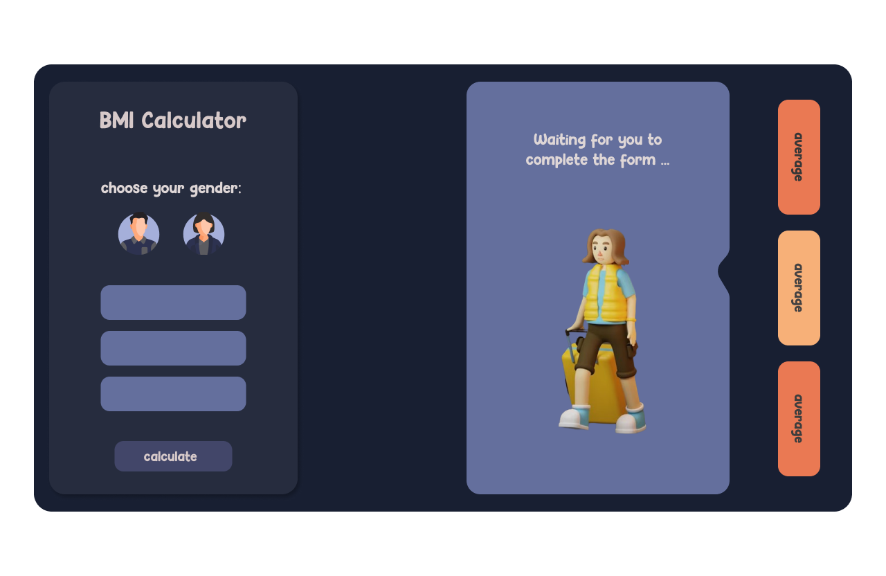

# BMI Calculate

Have you ever calculated your BMI? What is your body mass index?

## developer :

- Fatemeh Satouri
- Shayan Mahmoudi

## designer :
- Fatemeh Satouri

## About the project:
This project is to calculate your BMI.
First select the gender and then fill the form and then click the button.
To tell you how much it is based on your gender and your body mass!

## about us :

about us?
What good! That we can speak a few words!
Let's with how are you?
Let's begin.
I'm great today. Our project is best designed and finished.
It was a small class project that we tried to design ourselves.
There are about a few months into the Franter world and enjoyed playing with styles and sophistication. I am happy to check our ripazitors

## Working with the project:

Hey Baby!
Our background isn't it beautiful?
OK!!!!!
Select your gender first and then enter your information based on the tips we told you in the form and then press the button and then wait. We made it completely for you. Hope you enjoy.
